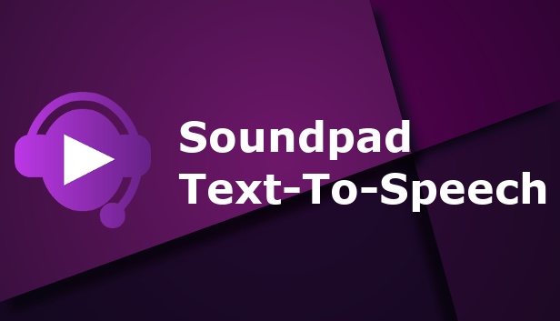
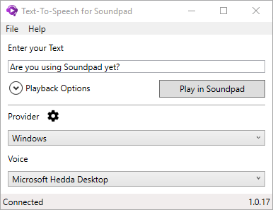

<h1 align="center">
   
</h1>

    Use different TTS voices and play directly into <a href="https://store.steampowered.com/app/629520/Soundpad/">Soundpad</a>.

## Table of contents

  * [Requirements](#requirements)
  * [Installation](#installation)
  * [TTS-Provider](#tts-provider)
    * [Windows](#windows)
    * [Universal](#universal)
    * [Amazon Polly](#amazon-polly)
    * [Google](#google)
  * [Contributing](#contributing)
  * [License](#license)
  * [Special thanks](#special-thanks)

## Requirements
This programm only works with the full Version of <a href="https://store.steampowered.com/app/629520/Soundpad/">Soundpad</a>.

* Windows 7 or higher
* .NET Framework 4.7.2 or higher

## Installation
You can download the installer here: [Setup.exe](https://soundpadcontrol.blob.core.windows.net/soundpad-tts/Setup.exe)

## TTS-Provider

### Windows
Default Windows TTS Provider

### Universal
**Works only with Windows 10**  
Additional Windows 10 provider. [How to add more voices?](https://support.office.com/en-us/article/download-voices-for-immersive-reader-read-mode-and-read-aloud-4c83a8d8-7486-42f7-8e46-2b0fdf753130)

### Amazon Polly
**Account required**  
A cloud service by Amazon Web Services, a subsidiary of Amazon.com, that converts text into lifelike speech.  

### Google
**Account required**  
A cloud service by Google that converts text into speech.    

## Contributing
You may contribute in several ways like creating new features, fixing bugs, improving documentation and examples
or translating any document here to your language. Read our [Code of Conduct](CODE_OF_CONDUCT.md).

## License
[MIT](LICENSE) - Nikodem Jaworski - 2018

## Special thanks
* [Leppsoft](https://leppsoft.com/soundpad/de/) - The Company behind Soundpad
* [Soundpad Connector](https://github.com/medokin/soundpad-connector) - Library to remote control Soundpad
